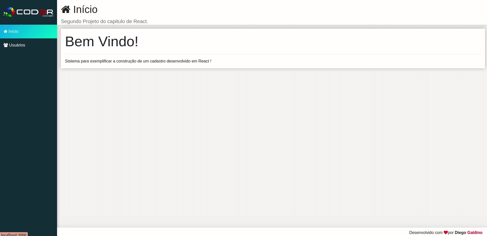

<h1 align="center">
 
     
     
    Crud
    </h1>
    
<b>Cadastro</b> Utilizando Crud(são as quatro operações básicas utilizadas em bases de dados relacionais fornecidas aos utilizadores do sistema.)

    

    
    

     
    <h3>Tecnologias:</h3>
    HTML 
    CSS 
    JAVASCRIPT
     
     
   <h3>Biblioteca Utilizada:</h3>
   REACT
    
   <h3>Framework Utilizada:</h3>
   Booststrap